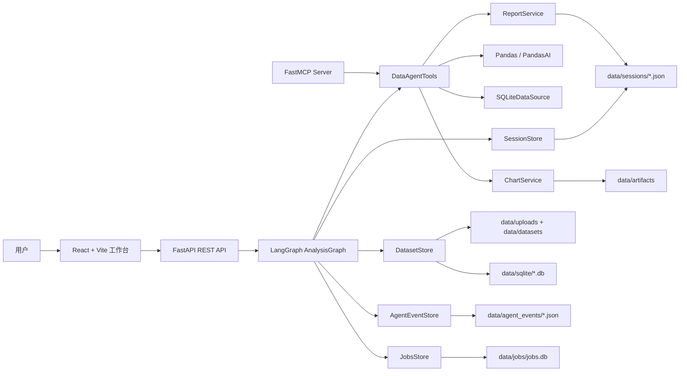

# DataAgent

DataAgent 是一个面向 CSV/XLSX 表格数据的智能分析 Agent 工作台。它把数据上传、字段识别、质量摘要、自然语言分析、SQL 查询、图表生成、多轮追问、Agent Trace、任务状态和 Markdown 报告串成一条可观察的分析链路，适合用于数据分析 Agent、业务报表自动化、表格问答和前后端分离应用演示。

当前版本偏向本地开发和 Demo 展示：上传文件、数据集元信息、会话历史、Agent 事件、任务记录和图表产物默认保存在项目根目录下的 `data/` 中。

## 项目简介

DataAgent 的目标不是只返回一个分析答案，而是展示一个数据分析 Agent 如何工作：

- 用户上传 CSV/XLSX 文件后，系统自动生成数据集 ID、字段 schema、数据预览和质量摘要。
- 用户用自然语言提问，后端通过 LangGraph 编排分析流程，并调用 Pandas/PandasAI/SQL/图表/报告工具。
- 前端展示回答、表格、图表、Markdown 报告，以及每一步 Agent Trace。
- 系统保存 session、job、agent event，让多轮追问、任务中心和可观测日志可以持续复用。

适用场景：

- 销售、运营、财务等表格数据的快速分析。
- 数据分析 Agent 的面试项目或技术演示。
- LangGraph + FastAPI + React 的前后端分离样例。
- MCP Tool 暴露本地数据分析能力的最小实现。

## 在线 Demo

当前仓库未配置公开在线地址。推荐本地启动后访问：

```text
前端工作台：http://127.0.0.1:5173
API 文档：http://127.0.0.1:8000/docs
健康检查：http://127.0.0.1:8000/health
```

## GIF 演示


## 架构图



## 技术栈

后端：

- Python 3.11
- FastAPI / Uvicorn / Pydantic
- LangGraph
- pandas / openpyxl
- PandasAI / pandasai-litellm
- SQLite / sqlite3
- Matplotlib / Plotly
- FastMCP
- pytest / httpx

前端：

- React 19
- Vite 7
- TypeScript 5
- Tailwind CSS
- lucide-react
- react-markdown

部署与运行：

- Docker
- Docker Compose
- `.env` 环境变量配置

## 功能列表

- CSV/XLSX 文件上传。
- 自动生成数据集 ID。
- 字段 schema、数据预览、缺失值、重复行、内存占用等质量摘要。
- 自然语言数据分析。
- 多轮追问上下文补全。
- `/data` 数据集概览命令。
- `/clean` 数据清洗建议命令。
- `/sql SELECT ...` 或直接输入 SQL 查询。
- `/chart` 或自然语言图表请求。
- `/report` 或 `generate report` 生成 Markdown 报告。
- 图表产物生成，静态访问路径为 `/artifacts/...`。
- 图表失败时降级为表格结果并返回 warning。
- 同步分析接口和 SSE 流式分析接口。
- Agent Trace 展示每一步 observation、thought、action、tool、耗时和 fallback 状态。
- Agent 事件历史和当前状态查询。
- Job 任务记录、任务事件、取消和重试接口。
- FastMCP 工具服务，可把核心分析能力暴露给 MCP 客户端。

## Agent Workflow

核心编排位于 `backend/app/graph/analysis_graph.py`，使用 LangGraph 将一次分析拆成可观察节点：

```text
START
  -> load_dataset
  -> resolve_context
  -> detect_command
  -> 按路由进入以下分支之一：
       /data   -> dataset_overview_tool
       /clean  -> data_cleaning_tool
       /sql    -> plan_query -> execute_query_tool -> analyze_query_result
       /chart  -> build_chart_tool
       /report -> export_report_tool
       普通问题 -> analyze_table_tool
  -> build_chart_tool
  -> export_report_tool
  -> save_session
  -> finalize
END
```

每个节点会写入 `trace_steps`，前端可展示：

- `step`：节点名。
- `status`：`success`、`warning`、`error`、`skipped`。
- `duration_ms`：节点耗时。
- `observation`：当前节点观察到的事实。
- `thought`：Agent 的决策依据。
- `action`：执行动作。
- `tool` / `tool_name`：调用工具。
- `input_summary` / `output_summary`：输入输出摘要。
- `fallback_used`：是否触发降级逻辑。
- `error_message`：错误信息。

## MCP Tool

MCP 服务入口位于 `backend/app/mcp_server.py`，基于 FastMCP 暴露 DataAgent 核心工具。

当前工具：

| Tool | 参数 | 说明 |
| --- | --- | --- |
| `analyze_table` | `dataset_id`, `question`, `session_id` | 使用自然语言分析数据集 |
| `build_chart` | `dataset_id`, `question`, `chart_type` | 生成图表产物，失败时降级表格 |
| `export_report` | `session_id`, `dataset_id`, `analysis_summary`, `chart_urls` | 导出 Markdown 报告 |

启动 MCP 服务：

```powershell
$env:PYTHONPATH="backend"
python backend/app/mcp_server.py
```

## Memory

DataAgent 当前使用本地文件和 SQLite 作为轻量 Memory：

| 类型 | 位置 | 作用 |
| --- | --- | --- |
| 数据集元信息 | `data/datasets/*.json` | 保存文件名、行列数、schema、preview、quality_summary |
| 上传原文件 | `data/uploads/*` | 保存 CSV/XLSX 原始文件 |
| 数据集 SQL 副本 | `data/sqlite/{dataset_id}.db` | 将上传数据写入 `main_table`，供 SQL 查询使用 |
| 会话历史 | `data/sessions/*.json` | 保存多轮对话，用于追问上下文补全和报告生成 |
| Agent 事件 | `data/agent_events/*.json` | 保存上传、分析、图表、报告等事件和 trace |
| 任务记录 | `data/jobs/jobs.db` | 保存 job 状态、进度、结果、错误和事件 |
| 图表产物 | `data/artifacts/*` | 保存 Plotly HTML 或 Matplotlib PNG |

说明：

- 当前没有用户登录、鉴权、权限隔离或密码存储。
- 当前存储适合本地开发和演示；生产环境建议替换为对象存储、关系型数据库和任务队列。

## 目录结构

```text
.
├─ backend/
│  ├─ app/
│  │  ├─ api/v1/             # REST API 路由
│  │  ├─ commands/           # /data、/sql、/chart、/report、/clean 命令解析
│  │  ├─ data_sources/       # 数据源抽象与 SQLite 数据源
│  │  ├─ graph/              # LangGraph 分析工作流
│  │  ├─ schemas/            # Pydantic 请求/响应模型
│  │  ├─ services/           # 数据集、会话、图表、报告、任务、事件服务
│  │  ├─ tools/              # Agent 可调用工具
│  │  ├─ main.py             # FastAPI 入口
│  │  └─ mcp_server.py       # FastMCP 工具服务
│  ├─ tests/                 # 后端测试
│  └─ Dockerfile
├─ frontend/
│  ├─ src/
│  │  ├─ api/                # 前端 API client
│  │  ├─ components/         # 工作台 UI 组件
│  │  ├─ types/              # API 类型定义
│  │  ├─ App.tsx             # 前端状态与页面编排
│  │  └─ main.tsx
│  ├─ package.json
│  └─ vite.config.ts
├─ data/
│  ├─ uploads/               # 上传文件
│  ├─ datasets/              # 数据集元信息 JSON
│  ├─ sqlite/                # 数据集 SQLite 副本
│  ├─ sessions/              # 会话 JSON
│  ├─ agent_events/          # Agent 事件 JSON
│  ├─ jobs/                  # Jobs SQLite 数据库
│  └─ artifacts/             # 图表 HTML/PNG 产物
├─ demo/                     # 示例数据
├─ exports/                  # 导出目录
├─ requirements.txt
├─ docker-compose.yml
└─ README.md
```

## 快速启动

建议使用 Python 3.11。

1. 创建并激活环境：

```powershell
conda create -n dataagent-py311 python=3.11 -y
conda activate dataagent-py311
cd D:\demo\DataAgent
python -m pip install -r requirements.txt
```

2. 配置 `.env`：

```powershell
Copy-Item .env.example .env
```

DashScope OpenAI 兼容模式示例：

```env
OPENAI_API_KEY=your-key
OPENAI_BASE_URL=https://dashscope.aliyuncs.com/compatible-mode/v1
PANDASAI_LLM_MODEL=openai/qwen-plus
```

3. 启动后端：

```powershell
$env:PYTHONPATH="backend"
python -m uvicorn app.main:app --app-dir backend --host 127.0.0.1 --port 8000 --reload
```

4. 启动前端：

```powershell
cd frontend
npm install
npm run dev
```

5. 打开工作台：

```text
http://127.0.0.1:5173
```

可选：指定前端访问的后端地址。

```powershell
cd frontend
$env:VITE_API_BASE_URL="http://127.0.0.1:8000"
npm run dev
```

## API

### Health

```http
GET /health
```

返回：

```json
{"status":"ok"}
```

### 上传数据集

```http
POST /api/v1/datasets
Content-Type: multipart/form-data
```

表单字段：

| 字段 | 类型 | 说明 |
| --- | --- | --- |
| `file` | file | CSV 或 XLSX 文件 |

返回核心字段：

```json
{
  "dataset_id": "ds_...",
  "filename": "sales_demo.csv",
  "rows": 120,
  "columns": 8,
  "schema": [],
  "preview": [],
  "quality_summary": {
    "missing_cells": 0,
    "duplicate_rows": 0,
    "memory_usage_bytes": 12345
  }
}
```

### 同步分析

```http
POST /api/v1/chat
Content-Type: application/json
```

请求：

```json
{
  "session_id": "sess_sales_demo",
  "dataset_id": "paste_dataset_id_here",
  "message": "plot monthly sales trend"
}
```

返回核心字段：

```json
{
  "session_id": "sess_sales_demo",
  "dataset_id": "ds_...",
  "answer": "...",
  "result": {
    "type": "dataframe | markdown | text | error",
    "value": null,
    "summary": "..."
  },
  "charts": [],
  "warnings": [],
  "errors": [],
  "trace_steps": []
}
```

### 流式分析

```http
POST /api/v1/chat/stream
Content-Type: application/json
Accept: text/event-stream
```

事件类型包括：

- `step_started`
- `step_finished`
- `text`
- `chart`
- `response`
- `error`
- `done`

### 生成报告

```http
POST /api/v1/reports
Content-Type: application/json
```

请求：

```json
{
  "session_id": "sess_sales_demo",
  "dataset_id": "paste_dataset_id_here"
}
```

返回：

```json
{
  "session_id": "sess_sales_demo",
  "report_markdown": "# ..."
}
```

### Agent 状态与事件

```http
GET /api/v1/agent/status?session_id=sess_sales_demo
GET /api/v1/agent/events?session_id=sess_sales_demo&limit=50
GET /api/v1/agent/sessions/{session_id}/trace
```

### Jobs

```http
GET  /api/v1/jobs?session_id=sess_sales_demo&limit=50
GET  /api/v1/jobs/{job_id}
GET  /api/v1/jobs/{job_id}/events
POST /api/v1/jobs/{job_id}/cancel
POST /api/v1/jobs/{job_id}/retry
```

## 性能指标

当前项目未接入压测或生产监控，以下指标适合作为本地 Demo 验收口径：

| 指标 | 当前口径 |
| --- | --- |
| 上传格式 | CSV、XLSX |
| 本地示例数据 | `demo/sales_demo.csv` |
| 同步分析可观测性 | 每次返回 `trace_steps` |
| 流式分析可观测性 | SSE 逐步返回 step 事件 |
| 图表产物 | 写入 `data/artifacts/`，通过 `/artifacts/...` 访问 |
| 任务记录 | 写入 `data/jobs/jobs.db` |
| 后端测试 | `backend/tests` |
| 前端构建 | `npm run build` |

本地验证命令：

```powershell
$env:PYTHONPATH="backend"
python -m pytest backend/tests
```

```powershell
cd frontend
npm run build
```

## Roadmap

- 增加用户认证、租户隔离和权限控制。
- 将本地 JSON/SQLite 存储升级为生产级数据库和对象存储。
- 接入异步任务队列，支持长任务取消、重试和恢复。
- 增加更多数据源：MySQL、PostgreSQL、S3、OSS、BI 平台。
- 增强图表类型：柱状图、折线图、散点图、透视表、组合图。
- 增加报告模板、导出 PDF/Docx 和定时报告。
- 为 Agent Trace 增加 OpenTelemetry 或 LangSmith 等观测后端。
- 强化安全策略：文件大小限制、类型校验、SQL 沙箱、CORS 白名单。
- 增加端到端测试和性能基准。

## 部署

### Docker Compose

当前 `docker-compose.yml` 启动后端 API，并将本地 `data/` 挂载到容器 `/app/data`。

```powershell
cd D:\demo\DataAgent
docker compose up --build
```

访问：

```text
http://127.0.0.1:8000/docs
```

### 生产部署建议

- 后端使用 Uvicorn/Gunicorn 或容器平台部署。
- 前端执行 `npm run build` 后将 `frontend/dist` 部署到静态资源服务。
- 将 `allow_origins=["*"]` 改为明确的前端域名白名单。
- 不要把真实 `.env`、上传数据和运行产物提交到 Git。
- 为上传文件设置大小限制、病毒扫描和生命周期清理策略。
- 将 `data/` 目录迁移到持久化卷或外部存储。

